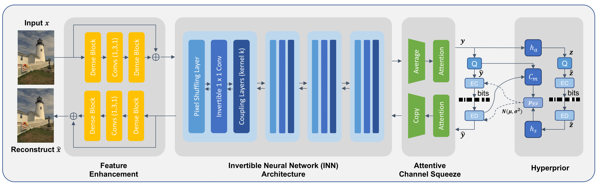
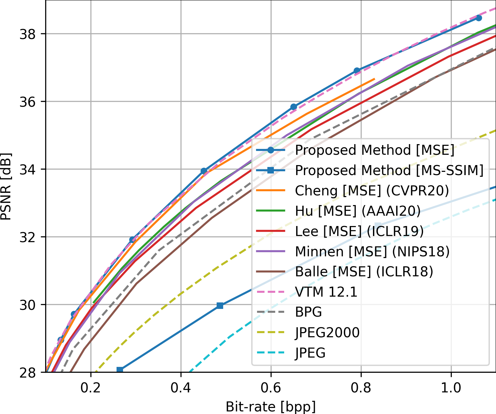

# InvCompress
Official Pytorch Implementation for "Enhanced Invertible Encoding for Learned Image Compression", ACMMM 2021 (Oral)


**Figure:** *Our framework*

## Acknowledgement
The framework is based on [CompressAI](https://github.com/InterDigitalInc/CompressAI), we add our model in compressai.models.ours, compressai.models.our_utils. We modify compressai.utils, compressai.zoo, compressai.layers and examples/train.py for usage.
Part of the codes benefit from [Invertible-Image-Rescaling](https://github.com/pkuxmq/Invertible-Image-Rescaling).

## Introduction
In this paper, we target at structuring a better transformation between the image space and the latent feature space. Instead of employing previous autoencoder style networks to build this transformation, we propose an enhanced Invertible Encoding Network with invertible neural networks (INNs) to largely mitigate the information loss problem for better compression. To solve the challenge of unstable training with INN, we propose an attentive channel squeeze layer to flexibly adjust the feature dimension for a lower bit rate. We also present a feature enhancement module with same-resolution transforms and residual connections to improve the network nonlinear representation capacity. 

[[Paper](https://arxiv.org/abs/2108.03690)] 


**Figure:** *Our results*

## Installation
As mentioned in [CompressAI](https://github.com/InterDigitalInc/CompressAI), "A C++17 compiler, a recent version of pip (19.0+), and common python packages are also required (see setup.py for the full list)."
```bash
git clone https://github.com/xyq7/InvCompress.git
cd InvCompress/codes/
conda create -n invcomp python=3.7 
conda activate invcomp
pip install -U pip && pip install -e .
conda install -c conda-forge tensorboard
```

## Usage

### Evaluation
If you want evaluate with pretrained model, please download from [Google drive](https://drive.google.com/file/d/1y6w60TPfvMRMC0iWpLNsSmfn7ZHevbRX/view?usp=sharing) or [Baidu cloud](https://pan.baidu.com/s/1D3RGIHAtOP9f7ZS_11R0QQ) (code: a7jd) and put in ./experiments/

Some evaluation dataset can be downloaded from 
[kodak dataset](http://r0k.us/graphics/kodak/), [CLIC](http://challenge.compression.cc/tasks/)

Note that as mentioned in original [CompressAI](https://github.com/InterDigitalInc/CompressAI), "Inference on GPU is not recommended for the autoregressive models (the entropy coder is run sequentially on CPU)." So for inference of our model, please run on CPU.
```bash
python -m compressai.utils.eval_model checkpoint $eval_data_dir -a invcompress -exp $exp_name -s $save_dir
```


An example: to evaluate model of quality 1 optimized with mse on kodak dataset. 
```bash
python -m compressai.utils.eval_model checkpoint ../data/kodak -a invcompress -exp exp_01_mse_q1 -s ../results/exp_01
```

If you want to evaluate your trained model on own data, please run update before evaluation. An example:
```bash
python -m compressai.utils.update_model -exp $exp_name -a invcompress
python -m compressai.utils.eval_model checkpoint $eval_data_dir -a invcompress -exp $exp_name -s $save_dir
```

### Train
We use the training dataset processed in the [repo](https://github.com/liujiaheng/CompressionData). We further preprocess with /codes/scripts/flicker_process.py
Training setting is detailed in the paper. You can also use your own data for training. 

```bash
python examples/train.py -exp $exp_name -m invcompress -d $train_data_dir --epochs $epoch_num -lr $lr --batch-size $batch_size --cuda --gpu_id $gpu_id --lambda $lamvda --metrics $metric --save 
```

An example: to train model of quality 1 optimized with mse metric.
```bash
python examples/train.py -exp exp_01_mse_q1 -m invcompress -d ../data/flicker --epochs 600 -lr 1e-4 --batch-size 8 --cuda --gpu_id 0 --lambda 0.0016 --metrics mse --save 
```


Other usage please refer to the original library [CompressAI](https://github.com/InterDigitalInc/CompressAI)


## Citation
If you find this work useful for your research, please cite:
```
@inproceedings{xie2021enhanced,
    title = {Enhanced Invertible Encoding for Learned Image Compression}, 
    author = {Yueqi Xie and Ka Leong Cheng and Qifeng Chen},
    booktitle = {Proceedings of the ACM International Conference on Multimedia},
    year = {2021}
}
```

## Contact
Feel free to contact us if there is any question. (YueqiXIE, yxieay@connect.ust.hk; Ka Leong Cheng, klchengad@connect.ust.hk)